## About this class
This Markdown is intended for a 4-hour Introduction to R class over two sessions. We are conducting exploratory data analysis (EDA) using the tidyverse packages, a powerful set of tools for working with data in R. This is not a comprehensive class given the short nature, and as such, expect to seek supplementary materials after this foundation. The main goal is exposure and hands-on practice of different difficulty levels. Refer to the 'Additional considerations' and 'Resources' sections at the end of this Markdown for next steps to consider. 

## Prerequisite assumed for this class
Familiarity writing code in any other programming language (e.g. HTML or any statistical program such as SAS and SPSS) and basic descriptive statistics foundation (e.g. average, median, maximum, minimum, range) is a prerequisite. Prior exposure to R or extensive experience working with data is not assumed.

## Source of the data
The survey data on professor evaluation used in this markdown was collected at the University of Texas at Austin during the academic years 2000 to 2002. Please refer to the acknowledgement section at the end of this markdown for further information.

## Commentaries interspersed in Markdown
Commentaries included throughout the R Markdown become relevant as students advance in their data exploration and analysis journey with R. Given the limited time, these are only discussed minimally in class if they become relevant in conversation. Otherwise, included here as a reference and encouragement for students to investigate further at a later time. 

###### **Nice to know:** This is an R Markdown which allows for descriptive text and code. Refer to these cheat sheets on [Markdown syntax](https://github.com/adam-p/markdown-here/wiki/Markdown-Cheatsheet) for styling code and other tips specific to R Markdown [here](https://www.rstudio.com/wp-content/uploads/2015/02/rmarkdown-cheatsheet.pdf) and [here](https://monashbioinformaticsplatform.github.io/2017-11-16-open-science-training/topics/rmarkdown.html). 

## Setting up the R Markdown file and handy shortcuts
The following box is called a chunk and it is where we write code. To insert a new chunk click on `insert > R` or use the shortcut `ctrl + alt + i`

```{r setup, include=FALSE}
knitr::opts_chunk$set(echo = TRUE)
```

### Reference these helpful shortcuts
As you write more code, shortcuts are a handy way to spare your hands from pointing and clicking, copying and pasting, and repetitive typing. 

Handy shortcuts to remember:

- Insert chunk: Ctrl + alt + i
- Run line of code: Ctrl + enter
- Run chunk of code: Ctrl + shift + enter 
- Pipe operator `%>%` : Ctrl + shift + m

###### **Nice to know**
Many more shortcuts exist! Check out the handy list provided within R Studio by going to the menu bar and clicking on `Help > Keyboard Shortcut Help`

###### **Nice to know:** 
The curly braces is where we can specify settings unique to the code in this chunk. The `include=FALSE` ask R to evaluate the code included, but to not include the code in the document produced (e.g. HTML, PDF, etc.) when this Markdown is knitted (i.e. rendered). 


## Start the project

### Identify question of interest
Course evaluation from students are used by higher education institutions as one of many factors when determining salaries for professors. Like any subjective measure, it is possible our own biases influence our perception. We are interested in exploring how students' perception of the professors' beauty and other characteristics unique to the professor (e.g. age, gender) relate to the overall rating given to the professor. We are focused on exploring relationships between instructor and student characteristics to our measure of overall effectiveness of the professor and as such, no causal statements or inferences are discussed. 


### Collect and store the data
To explore this question we are asking lower division and upper division undergraduate students at the university to complete a short survey where they rate the beauty of each professor. We are then exploring how these beauty rating and other characteristics relate to the professor average evaluation score.

> ACTIVITY: How would could we organize the data?

Using a pen and paper or favorite software (e.g. excel or sheets) organize the data collected thus far. Remember you will be collecting this information for more than 400 courses. The goal is to consider decisions made when organizing data.   

```{r, echo=FALSE}
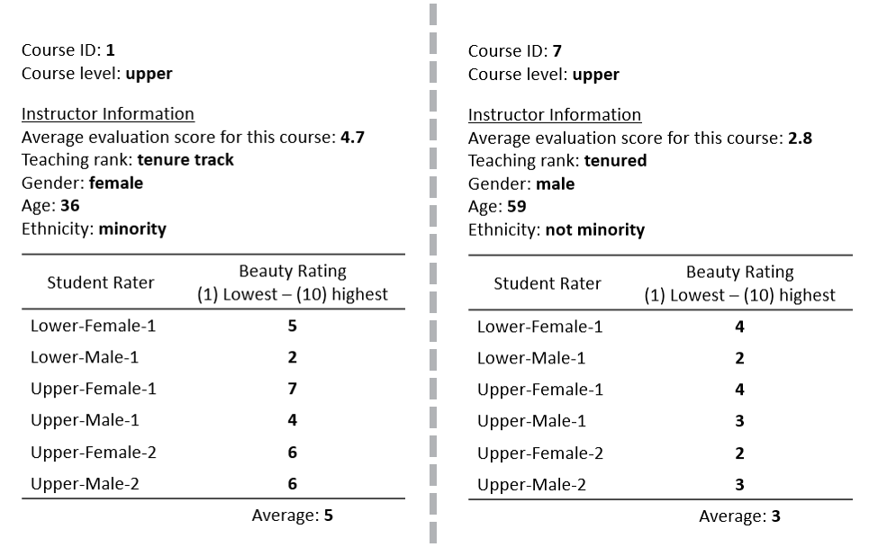

```


### Data common language

The different language we use to refer to the same concept sometimes makes talking about data more difficult that it should be. These are some common words often used interchangeably:

- **data set, data frame, tibble:** 
Tabular/rectangular structure for storing data (think excel)

 
```{r, echo=FALSE}
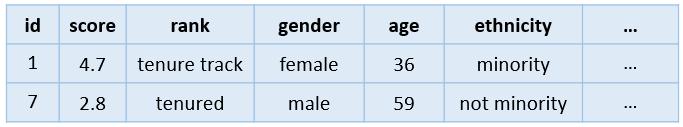
```

- **observation, row, record:** A member of the data set representing the information for a unit of analysis (e.i. the data available for one professor, one class, etc.)
 
 
```{r, echo=FALSE}
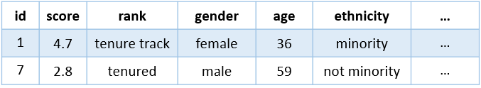
```

- **variable, column, vector, feature:** The values of one of the type of information collected for all members in the data set (i.e. the ages for all professors in the data set) 

 
```{r, echo=FALSE}
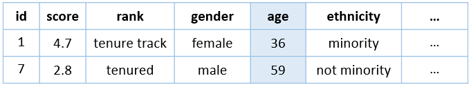
```


### Load packages used in the Markdown
Install once (`install.packages(<package name>)`) for your current version of R, load every session (`library(<package name>)`). We'll come back to this section whenever is time to load a package. 

Packages we will need for this class are: dplyr, ggplot2, and tidyr

```{r}
library(dplyr)   # For data manipulation and exploration 
#<package needed>
#<package needed>
```


**Best practices to remember:**

- Do not include code to install packages in source file (e.i. R Markdown or Script)

- Always include code to load packages at the top of the source file

- Include a comment next to package being loaded using `#` to succinctly describe purpose of package for future collaborators (includes your future self!)

- Only load packages used in this source file to reduce conflicts between packages and reduce need for future collaborator to install unnecessary package to run code


**Where to find documentation:**

It is impossible to remember all the functions available in a package given the vast number of functions and the periodic changes as developers in the open source community update and improve the packages they maintain. 

Check out the documentation and handy cheat sheets available online for each package.

- Search the [R Documentation Website](https://www.rdocumentation.org/)
- Search the documentation via console using `help(<function or package>)`
- Search the documentation on the `Help` window within R Studio


**Handy cheat sheets for these packages:**

- [Data Wrangling with dplyr and tidyr cheat sheet](https://www.rstudio.com/wp-content/uploads/2015/02/data-wrangling-cheatsheet.pdf)
- [Data Vizualization with ggplot2 cheat sheet](https://www.rstudio.com/wp-content/uploads/2015/03/ggplot2-cheatsheet.pdf)
- [Data Science Cheat Sheet for Beginner](https://s3.amazonaws.com/assets.datacamp.com/blog_assets/Tidyverse+Cheat+Sheet.pdf)

###### **Nice to know: **
Order in which packages are loaded matters because sometimes packages have functions with the same name, but different output and quirks (e.g.parameters expected). If you want to know which functions may be in different packages loaded in this R session that may conflict with each other, type `conflicts(detail = TRUE)` on the console.  


## Read all the data collected 
Lucky for us, this data from 463 courses and professor was already collected for us! Now we can use R to read and explore it together.

Data can come from many sources. Our data is available and stored online on the Open Intro server in a format native to R (`.RData` extension).

```{r demo1,}
# Download data frame from Open Intro server to current working directory
download.file("http://www.openintro.org/stat/data/evals.RData",
              destfile = "data/evals.RData")
```

Load the data frame to the environment so that it is accessible for our use.
```{r demo2}
# Read data frame downloaded
load("data/evals.RData")
```

Notice that the `evals` object storing the data frame with our data has been added to the global environment window. Now you use functions to explore it. 


###### **Nice to know**
Often data comes as text files such as CSV and Tab-delimited files. Check out the documentation for tidyverse package `reader` for helpful functions to read these files. If reading data from a database or API, use your favorite browser to search for best package for your needs. 


> ACTIVITY 1: Get a sense of the data using Base R functions

Use these Base R functions to explore the data frame where the data is stored:

- `class(<data>)`
- `dim(<data>)`
- `names(<data>)`
- `head(<data>)` and `head(<data>, <number>)`
   - How does the second parameter (`10`) affect the output?
- `str(<data>)`
- `summary(<data>)`
   - Is the same information reported for all variables?

**Consider the following questions:**

1. How many observations/rows and variables/columns are included in the data?
2. What kinds of variables/columns are reported:
  - Which variables are continuous and what do they mean?
  - Which variables are categorical and what do they mean?
  - Need a hint? Check out the data dictionary below.
3. Which of these functions did you find most helpful?
4. How does the structure of the data compare to how you organized it on prior activity?


Insert your chunks for this activity below:


### Dictionary describing data collected

Description of variable/column as explained by [Open Intro data documentation](https://www.openintro.org/stat/data/?data=evals)

- `score`: Average professor evaluation score: (1) very unsatisfactory - (5) excellent.
- `rank`: Rank of professor: teaching, tenure track, tenured.
- `ethnicity`: Ethnicity of professor: not minority, minority.
- `gender`: Gender of professor: female, male.
- `language`: Language of school where professor received education: English or non-English.
- `age`: Age of professor.
- `cls_perc_eval`: Percent of students in class who completed evaluation.
- `cls_did_eval`: Number of students in class who completed evaluation.
- `cls_students`: Total number of students in class.
- `cls_level`: Class level: lower, upper.
- `cls_profs`: Number of professors teaching sections in course in sample: single, multiple.
- `cls_credits`: Number of credits of class: one credit (lab, PE, etc.), multi credit.
- `bty_f1lower`: Beauty rating of professor from lower level female: (1) lowest - (10) highest.
- `bty_f1upper`: Beauty rating of professor from upper level female: (1) lowest - (10) highest.
- `bty_f2upper:` Beauty rating of professor from second level female: (1) lowest - (10) highest.
- `bty_m1lower`: Beauty rating of professor from lower level male: (1) lowest - (10) highest.
- `bty_m1upper`: Beauty rating of professor from upper level male: (1) lowest - (10) highest.
- `bty_m2upper`: Beauty rating of professor from second upper level male: (1) lowest - (10) highest.
- `bty_avg`: Average beauty rating of professor.
- `pic_outfit`: Outfit of professor in picture: not formal, formal.
- `pic_color`: Color of professor's picture: color, black & white.
    
    
    
## Expanding the capabilities of Base R with the tidyverse packages
A collection  of packages have been created to work well together when reading, manipulating, analyzing, and visualizing data and are collectively known at the [tidiverse](https://www.tidyverse.org/). 


We will be using functions from a few of these packages:

- `dplyr`: For data manipulation
- `ggplot`: For data visualization
- `tidyr`: For changing data structure
- `stringr`: For working with strings/text


### Load the `dplyr` package
Before using the functions provided by the package you need to install the package if needed and load it every R session.

> ACTIVITY 2: Scroll up to the top of the program and load the `dplyr` package.


### Turn the data frame into a tibble
A tibble is a more modern and improved version of a data frame.  

Use the function `as_tibble(<data.frame>)` from the dplyr package to convert the data frame read originally into a tibble and store this new object to the variable `tb` using the assignment operator `<-`.

```{r demo3}
tb <- as_tibble( evals)
```

**Syntactically correct variable names**
- letters
- numbers
- period or underscore
- starts with a letter
- starts with a dot not followed by a number (e.g. ".2way" is not valid)
- reserved words are not valid
							
							

> ACTIVITY 3: Use the function `class(<data>)` to compare the class of the data frame and the tibble

Insert your code chunks here

###### **Nice to know:** 
One of the differences between a tibble and data frame is how the data is printed. However, when using the R Markdown this is not obvious. Want to try it? Compare the output of these two code on the console `print(evals)` vs. `print(tb)`. To learn more about this data structure [check out the tibble docummentation](https://cran.r-project.org/web/packages/tibble/vignettes/tibble.html).


> ACTIVITY 4: Use the function `glimpse(<data>)` to explore the data set

The function `glimpse(<data>)` provides similar information as the `str(<data>)` function included as part of Base R when used on a data frame and tibble. 


Insert your code chunks here


### Use the pipe operator `%>%` to chain code in an easy to read format

The pipe operator `%>%` makes R use the object listed to the left of the operator as the first parameter/argument in the function used to the right of the operator.

**Equivalent output, different approaches:**
```{r demo4}
class(tb)

```

```{r demo5}
tb %>% class()
```

> ACTIVITY 5: Use the pipe operator to print the last 10 records in the data

Unlike `head()` which prints the first 6 rows in  the data by default, the function `tail()` prints the last 6 rows. Use the pipe operator `%>% and the `tail()` function to print the last 10 records in the data.


Insert your code chunks here


## Perform univariate and bivariate data exploration using the `dplyr` verbs

- Univariate = one variable
- Bivariate = two variables
- Multivariate = many variables

Cheat Sheet:
- [Data Wrangling with dplyr and tidyr cheat sheet](https://www.rstudio.com/wp-content/uploads/2015/02/data-wrangling-cheatsheet.pdf)

**Use `select()` to pick desired variables/columns**

```{r, echo=FALSE}
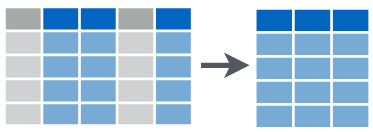
```

**Check out the `select()` helper functions on the cheat sheet for more sophisticated ways to select columns**


### How many unique evaluation scores are reported?

**Demo**

Selecting one variable:
```{r demo6}
tb %>% 
  select(score) %>% 
  n_distinct() 
```

Selecting multiple variables to remove duplicates:
```{r demo7}
tb %>% 
  select(age, ethnicity, rank, gender, language) %>% 
  n_distinct() 
```


**Does this suggest that our assumption that every class was taught by a different professor may be questionable?**


> ACTIVITY 6: 1) What is the overall proportion of males and females? 2) Are the overall proportion of male and female professors equal across each tenure rank (teaching, tenure track, tenure)?

Suggested steps:

1. Use ``select(var1)` or `select(var1, var2)` to pick one or two variables/columns of interest from the data (`rank` and `gender`). When using more than one variable, separate each variable within the select function with a comma.
2. Then use the `table()` function to create a frequency table from those columns
3. Then use the `prop.table()` function to create a table of proportion from the frequency table


Overall gender proportion


Insert your code chunks here


Gender proportion by rank


Insert your code chunks here


**Use `summarize()` or `summarise()` to aggregate across observations/rows while *dropping* the observations**


```{r, echo=FALSE}
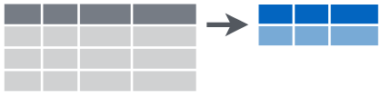
```

### What is the average age of all the professors?

**Demo**

One variable and function
```{r demo8}
tb %>% 
  summarize(mean_age =mean(age))
  
```

Multiple variables and functions
```{r demo9}
tb %>% 
  summarize(mean_age = mean(age), mean_score = mean(score),
            min_age = min(age), min_score = min(score)) 
```

> ACTIVITY 7: Modify the code above to find the maximum and median scores and age using the functions `max()` and `median()`. 


Insert your code chunks here


**Use `mutate()` to make a new variable/column that aggregates across observations/rows while *keeping* the observations**

```{r, echo=FALSE}
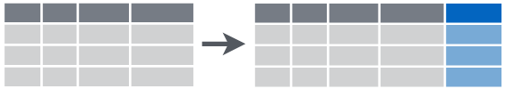
```


### What is the average age of all the professors?

**Demo**

```{r demo10}
tb %>% 
  mutate(mean_age = mean(age), mean_score = mean(score),
            min_age = min(age), min_score = min(score)) %>% 
  head()
```


**Use `filter()` and `Boolean operators` to subset the data**

```{r, echo=FALSE}
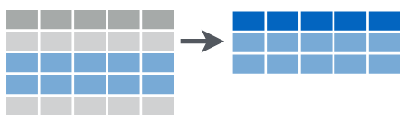
```


**Boolean operators in R**

```{r,echo=FALSE}
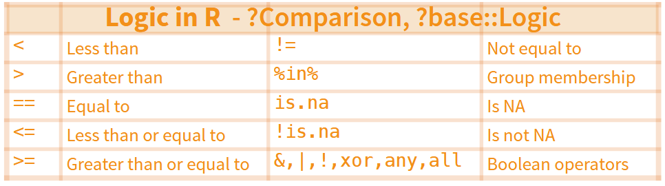
```


### Are the proportion of female professors within each tenure track comparable to each other?

#### Approach #1

**Demo**
```{r demo11}
tb %>%
  filter(rank == 'teaching') %>% 
  select(rank, gender) %>% 
  table() %>% 
  prop.table() %>% 
  round(3) * 100
```

```{r demo12}
tb %>%
  filter(rank == 'tenure track') %>% 
  select(rank, gender) %>% 
  table() %>% 
  prop.table() %>% 
  round(3) * 100
```

```{r demo13}
tb %>%
  filter(rank == 'tenured') %>% 
  select(rank, gender) %>% 
  table() %>% 
  prop.table() %>% 
  round(3) * 100
```


> ACTIVITY 8: Compare the proportions of female professors by tenure track. Can you speculate what these numbers might mean? Are male or females over or under represented within any tenure track? (no code needed, reference output above)


**Use `group_by()` and `mutate()` to aggregate within subgroups**

```{r,echo=FALSE}
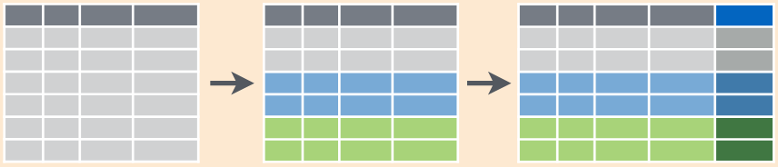
```


### Are the proportion of female professors within each tenure track comparable to each other?

#### Approach #2


**Demo**
```{r demo14}
tb_gen_relprop<- tb %>%
  group_by(rank) %>% 
  mutate(rank_n = n()) %>% 
  group_by(rank, gender) %>% 
  mutate(gender_n = n(), 
         gender_relprop = round((gender_n/rank_n),3) * 100) %>% 
  arrange(rank, gender)

tb_gen_relprop %>% head()
```

```{r demo15}
tb_gen_relprop %>%
  select(rank, gender, gender_relprop) %>% 
  distinct()
```


#### Does the average evaluation score for professors vary by rank? 

> ACTIVITY 9: Use `group_by()` along with other dplyr verbs learned to compute the 1) average evaluation score (`score`), 2) average class size (`cls_students`), and 3) median class size by tenure (`rank`). Refer to the prior demo. Take 2 minutes to try on your own and then discuss with your partner to compare approach. 


Insert your code chunks here


## Optional homework
- Review commentaries within Markdown
- Tinker with these dplyr verbs to explore other questions about the data
- Reach out on slack if you need help!

-------------------------------------------------------------------------------
-------------------------------------------------------------------------------

# Session 2
In this part of the class we will use the `ggplot2` package to visualize our data.

We will finish with a demo where we use the tidyr package to change the structure of the data set and the stringr package to extract information from text before visualizing with `ggplot()` function.

## Why use visualization during exploratory phase?
To understand the properties of the data efficiently and discover trends and relationships not evident from aggregate measures (e.g. mean, median, standard deviation, etc.). 

Check out this [matrix for ideas on which graphs to create](https://extremepresentation.typepad.com/files/choosing-a-good-chart-09.pdf) depending on the types of variables and purpose of the visual.

```{r, echo=FALSE}
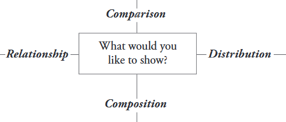
```

## Visualizing data with `ggplot2`

Reference the [Data Vizualization with ggplot2 cheat sheet](https://www.rstudio.com/wp-content/uploads/2015/03/ggplot2-cheatsheet.pdf)


**The basic code**

```{r, echo=FALSE}
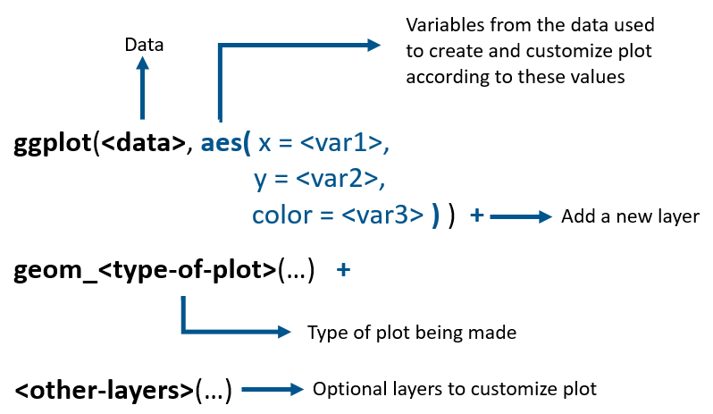
```

**Grammar of graphics crash course**
We'll be deconstructing these plots and tinkering with the code together to learn more about the ggplot grammar of graphics framework. The best way to learn is to fail, learn from it, and try again. Practice, practice, practice!

### What is the distribution of the class size `cls_students`? Is it skewed?

**demo**

Basic plot
```{r demo16}
tb %>% 
  ggplot( aes(x = cls_students) ) +
  geom_density()
```

Documenting plot with titles and axis label using `labs()`
```{r demo17}
tb %>% 
  ggplot( aes(x = cls_students) ) +
  geom_density() +
  
  # Additional layers to customize plot
  labs(title = 'Distribution of the total number of students in the class',
       x = 'Class size')
```

Using themes (`theme_<name>()`) to customize the look of plots. Note, you can make your own themes and use other packages that provide additional themes. 

```{r demo18}
tb %>% 
  ggplot( aes(x = cls_students) ) +
  geom_density() +
  
  # Additional layers to customize plot
  labs(title = 'Distribution of the total number of students in the class',
       x = 'Class size') +
  
  theme_classic()
```

> ACTIVITY 10: Visualize the distribution of the average professor evaluation score
using a box plot

Suggested steps:

- For the `x` aesthetic use `1` as a dummy (more on that later)
- For the `y` aesthetic use `cls_students`
- Refer to previous activity to add titles and customize with themes


Insert your code chunks here


**Demo**

```{r demo19}
tb %>% 
  ggplot(aes(x= score, fill = gender)) +
  geom_density( alpha = 1/5) 
```

```{r demo20}
tb %>% group_by(rank) %>% 
  mutate(mean_age = mean(age)) %>% 
  
  ggplot(aes(x= age)) +
  geom_density() +
  geom_vline( aes(xintercept = mean_age) ) +
  facet_grid(rank ~ .) 
```

```{r demo21}
tb %>% group_by(rank) %>% 
  mutate(mean_age = mean(age)) %>% 
  
  ggplot(aes(x= age)) +
  geom_density() +
  geom_vline( aes(xintercept = mean_age) ) +
  facet_grid(rank ~ gender) 
```

```{r demo22}
tb %>% group_by(rank) %>% 
  mutate(mean_age = mean(age)) %>% 
  
  ggplot(aes(x= age)) +
  geom_density(aes(fill = ethnicity), alpha = 1/5) +
  geom_vline( aes(xintercept = mean_age) ) +
  facet_grid(rank ~ gender) 
```


```{r demo23}
tb %>% group_by(rank) %>% 
  mutate(mean_age = mean(age), median_age = median(age)) %>% 
  
  ggplot(aes(x= age)) +
  geom_density(aes(fill = ethnicity), alpha = 1/5) +
  geom_vline( aes(xintercept = mean_age) ) +
  geom_vline( aes(xintercept = median_age), linetype = 'dashed', color = 'blue' ) +
  facet_grid(rank ~ gender) +
  theme_classic() +
  labs(title = 'Age distribution by tenure track, gender, and ethnicity',
       x = 'Instructor age')
```


> ACTIVITY 11: Explore a continuous and 1-2 categorical variables

Visualize the distribution of the average professor evaluation score by different professor characteristics. 

Check out the data visualization cheat sheet and the chart selection reference page for inspiration. Challenge yourself to try faceting by a variable of interest. 

Characteristics to consider:
- 1) tenure track (`rank`)
- 2) ethnicity (`ethnicity`)
- 3) gender (`gender`) 

Plots to visualize distribution:
- 1) density plot (`geom_density()`)
- 2) box plot (`geom_boxplot()`)
- 3) violin plot (`geom-violin()`)
- 4) histogram (`geom_histgram()`)

Select one characteristic and plot of interest. Are the distributions comparable?


Suggested steps:

- For the `x` aesthetic use a characteristic
- For the `y` aesthetic use `cls_students`
- For `fill` aesthetic use a characteristic
- For `facet_grid()` aesthetic use a characteristic
- Refer to previous code to add titles and customize with themes


Insert your code chunks here


> ACTIVITY 12: Explore two continuous variables

Questions of interest:
- Do professors who teach classes with more students tend to receive higher or lower evaluation scores? 

- Do courses with higher evaluation completion rate tend to rate the instructor more favorably or poorly? 

- Other bivariate relationships


**Demo**

```{r demo24}
tb %>% 
  ggplot(aes(x = cls_students, y = score)) +
  geom_jitter()
```


```{r demo25}
tb %>% 
  filter(cls_students < 200) %>% 
  ggplot(aes(x = cls_students, y = score)) +
  geom_jitter(aes(color = gender)) +
  
  geom_smooth(se = TRUE)
  
```


**Demo**
Combining dplyr verbs to calculate proportions and visualize the composition.

```{r demo26}
prop_rankbyeth <-tb %>% 
  group_by(rank, ethnicity) %>% 
  tally() %>% 
  group_by(rank) %>% 
  mutate(percent = round( n/sum(n) * 100, 0)) 
  

prop_rankbyeth
```

```{r demo27}
prop_rankbyeth %>% 
  ggplot( aes(x= rank, y = percent, fill = ethnicity)) +
  geom_col() +
  coord_flip()
```


Visualizing two categorical variables.

Picture formality by tenure track status
```{r demo28}
tb %>% 
  group_by(pic_outfit, rank) %>% 
  count() %>% 
  ggplot(aes(x = pic_outfit, y = rank)) +
  geom_tile( aes(fill = n))
  
```


> ACTIVITY 13: Data exploration through visualization

Choose one of the 2 questions below (or one of your own) to explore visually using an appropriate plot for the relevant variable types. 

Remember to document your plot with proper title and axes label. Explore some of the built-in themes. When you start typing `theme_` different themes available will come up. 

1. **Is there a relationship between instructor average beauty rating and instructor evaluation score? Does this vary by gender? Does it vary by tenure track?**


Insert your code chunks here

    

2. How does the average beauty score given by students within the same division compare? See suggestions below, choose one to explore.

- A) **How do lower division female beauty rating (`bty_f1lower`) compare to the average beauty rating given by lower division male (`bty_m1lower`)? How about within upper division students (`bty_f1upper`and `bty_f2upper` versus `bty_m1upper`, `bty_m2upper`)**


A)
```{r}
tb %>% 
  ggplot(aes(x = bty_f1lower, y = bty_m1lower)) +
  geom_jitter() +
  geom_smooth()
```


  


## Visualizing data  - a more complex demo incorporating data restructuring
The purpose of this demo is to demonstrate a more complex data visualization example using various tidy verse packages. The focus is on showing the process conceptually rather than understanding how the syntax works. Though if time allows, we can discuss in detail.

It is not expected that you will understand every single step. Rather the purpose is to have a discussion on some key considerations when making data visualization including:
- data restructuring
- customizing plots

**Visualizing the end goal**
See final graph below to visualize better the need for restructuring


**Restructuring data and creating new variables**

The original data set does not have a variable identifying each class. Creating a class ID starting with 1. This will make it easier to show data before and after restructuring. 
```{r demo29}
tb2 <- tb %>% 
  mutate(cls_id = seq(1:n()))

# Quick Check
tb2 %>% summarize(min_clsid = min(cls_id), 
                  max_clsid = max(cls_id),
                  unique_clsid = n_distinct(cls_id))
```

Restructuring data set to make tidy so that all beauty ratings provided for each professor by the different students are in one column (`bty_rating`) rather than spread across the 6 columns. 

```{r demo30}
tb_long <- gather(tb2, key = bty_rater, value = bty_rating,
       bty_f1lower, bty_m1upper,
       bty_f1upper, bty_m1upper,
       bty_f2upper, bty_m2upper) %>% 
      
       # Keeping rows of interest, removes duplicates
       select(cls_id, bty_rater, bty_rating, rank, pic_outfit, pic_color) %>% 
       distinct(cls_id, bty_rater, bty_rating, rank, pic_outfit, pic_color) %>% 
       arrange(cls_id) %>% 

      # Creating a new variable
      mutate(gender_student =
               # Converting to a factor - important for data viz
               as.factor(
                 # Extracting information from string to create new variable
                 if_else(stringr::str_detect(bty_rater, 'f'), 'female','male')),
             div_student = 
               as.factor(
                 if_else(stringr::str_detect(bty_rater, 'upper'), 'upper','lower')))
```

Quick check of restructured data set
```{r demo31}
glimpse(tb_long)
```


Before restructuring
```{r demo32}
tb2 %>% filter(cls_id %in% (c(1,25))) %>% 
  arrange(cls_id) %>% 
  select(cls_id, starts_with('bty_'), rank, contains('pic'))
```

After restructuring
```{r demo33}
tb_long %>% filter(cls_id %in% (c(1,25))) %>% 
  arrange(cls_id, gender_student, div_student)
```


Visualizing the data - Did students generally agree on the instructor's beauty rating?
```{r demo34}
tb_long %>% ggplot( aes(x = div_student, y = bty_rating, color = pic_outfit)) +
  geom_boxplot() +
  labs(title = 'Distribution of beauty rating by student division and instructor outfit',
      x = 'Student division',
      y = 'Beauty rating') +
  theme_classic()
```

```{r demo35}
tb_long %>% ggplot( aes(x = div_student, y = bty_rating, color = pic_outfit)) +
  geom_boxplot() +
  facet_grid(. ~ rank) +
  scale_y_continuous(limits = c(0,10))+
   
  labs(title = 'Distribution of beauty rating \nby student division, gender and instructor outfit',
      x = 'Student Division',
      y = 'Beauty Rating',
      color = 'Instructor Picture') +
  theme_classic()
```


**Breaking down the data restructuring steps**
This is a more complicated example. Curious? Take it a part and see how it works. Some notes below to help you get started.

The new column `bty_rater` represents information about the students rating the beauty of each professor: f = female, 1 or 2 = first or second rater asked, lower or upper = undergraduate division of rater. By splitting these values representing distinct information on different columns we can make our data tidy. Remember these used to be variables in the data set.

**Using dplyr and stringr to create desired data set**

Need to create a column for rater gender and division so that it can be used as aesthetics when plotting. Used a stringr function to split this string. Want to make these variables factors so that they are plotted properly. 


Want to explore functions better? Check out this documentation:
[stringr package for working with strings](https://stringr.tidyverse.org/reference/str_detect.html)
[tidyr package for restructuring](https://tidyr.tidyverse.org/reference/gather.html)


**End of the program documentation**
This helps to document what version of packages where used to produce this document. Helpful for your future self and collaborators who may need to reproduce it. 

```{r demo36}
sessionInfo()
```

--------------------------------------------------------------------------------
--------------------------------------------------------------------------------

# Wrapping up class
Thank you for participating. This is only the beginning and a jump start to working with data using R. Let your curiosity guide you, and remember, it takes time to learn and become proficient at anything. Be patient and have fun :)


# Assumptions
Simplification were made in the exploration of this data:

- Data represent 463 distinct courses. We assumed there were 463 instructors, even though this is not the case given that one instructor can teach multiple courses in the same academic year. Understanding independence between records is key for choosing appropriate statistical model for inference and for exploring the data accuratedly. This is not explored in this class. 


# Additional topics to explore
Start with a topic or question of interest and explore different strategies to work with the data. There are many built-in data sets and other data available via packages that make this possible. Highly recommend the package `openintro` and the associated free statistics books and online labs. 

Foundation to explore with time:
- Best practices for writing code [see google's R style guide]()
- Data structures
  - Factors
  - Lists
- Conditional logic and Functional Programming (explore the map family)
- Exploring and addressing missing data
- Many other dplyr verbs and sophisticated approaches to work with data
- Working with text data
- So much more to learn...


# Resources
Most of these resources are free. Some may have a cost for the full resource or for additional services (e.g. certification of completion). Have fun learning and reach out via slack if feeling stuck! 

* 
[R for Data Science](http://r4ds.had.co.nz/)

* 
[RStudio Cloud Primers for hands on exercises](https://rstudio.cloud/learn/primers)

* 
[Learn more about ggplot and data visualization](http://socviz.co/)

*
[OpenIntro Statistics and R Resources](https://www.openintro.org/)

* 
[Cheat Sheets for quick reference](https://www.rstudio.com/resources/cheatsheets/)


#### Also check out these resources:

* 
[Learn by doing with R Exercises](https://www.r-exercises.com/start-here-to-learn-r/)

* 
[DataCamp (not all classes are free)](https://www.datacamp.com/courses/free-introduction-to-r)

* 
[Edx programming in R for Data Science](https://www.edx.org/course/programming-in-r-for-data-science)


* 
[R Bootcamp](https://www.jaredknowles.com/r-bootcamp/)

* 
[Learn R and Stats with the Swirl package](https://swirlstats.com/students.html)

* 
[Learn by example with this 15 Page Tutorial for R](http://www.studytrails.com/r/15-page-tutorial-for-r/)

 


# Acknowledgement
The evals data set used for this class was was provided by [OpenIntro](https://www.openintro.org/stat/data/?data=evals) and originally corrected at the [University of Austin Texas]()

